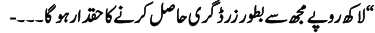
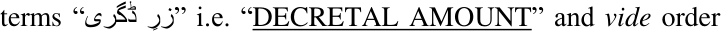
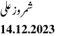

# JUDGMENT SHEET
IN THE LAHORE HIGH COURT,

# MULTAN BENCH, MULTAN.

# JUDICIAL DEPARTMENT

# W.P No.10312/2023
(Muhammad Arif Vs. ASJ, etc.)

Date of hearing:
12.12.2023 Petitioner by:
Malik
M.
Majid
Shahbaz
Khokhar, Advocate. Respondents by:
Mr. Iftikhar Ibrahim Qureshi,
Assistant Advocate General with
Ashraf A.S.I. SARDAR MUHAMMAD SARFRAZ DOGAR, ,J.:- This petition filed under Article 199 of the Constitution of Islamic Republic of Pakistan, 19731 is voiced against the order dated 27.05.2023,2 whereby the learned Additional District Judge, Karor, District Layyah,3 while implementing his order dated 06.02.2023, ordered for attaching the property of petitioner measuring 5 Kanal 15 Marla & 74 Feet falling in Khata No.30, situated in revenue estate Chak No.399/TDA.

2.
The chronological order of events of this case is that respondent No.2/Ahmad Raza son of Ghulam Murtaza got a case FIR No.989/2022 dated 26.12.2022 registered for the offence under section 489-F PPC with the Police Station Karor, District Layyah against the petitioner. The respondent No.2 alleged therein that on 28.01.2019 at about 10:00 a.m, he was present at his house when the petitioner came and purchased a Bedford Bus bearing registration No.I.D.T3112, Chassis 1 The Constitution.
2 Impugned order.
3 Learned respondent No.1.

---

2
W.P. No.10312 of 2023.
(Muhammad Arif v. ASJ, etc.)

# No.602825NJM, Engine No.L5-20156, Model 1983 from him

for a consideration of Rs.16,00,000/- in presence of witnesses. The petitioner paid Rs.600,000/- at the spot and for the payment

# of
remaining
sale
consideration,
he
issued
Cheque

# No.804201964 of his account maintained with Bank of Punjab

# Chobara Road, Layyah. The Bus was handed over to the

petitioner, however, on presentation, the said cheque was dishonoured. 2-A. After registration of above noted case, the petitioner filed his pre-arrest bail before the learned respondent No.1 and the same was confirmed vide order dated 06.02.2023 on the basis of compromise. However, when the petitioner did not honour the commitment, the respondent No.2 approached the learned respondent No.1 and got the bail of the petitioner cancelled vide order dated 10.05.2023. Thereafter, on 25.05.2023, the respondent No.2 moved an application before learned respondent No.1 for recovery of an amount of Rs.10,00,000/-. Whereupon, the learned respondent No.1 passed the impugned order dated 27.05.2023, which necessitated filing of instant petition.

3.
Learned counsel for the petitioner inter-alia argued that the impugned order passed by respondent No.1 is illegal, unlawful and contrary to law & facts; that bail allowed to the petitioner has already been cancelled and learned respondent No.1 had no legal justification to pass the impugned order which is ineffective against the legal rights of the petitioner; that while passing the impugned order, learned respondent No.1 did not consider the relevant law and facts applicable to present case and that on one hand, bail of the petitioner has been cancelled whereas on the other hand his property has been attached on the basis of his own statement recorded in bail proceedings which is not permissible in the eye of law. Finally

---

3
W.P. No.10312 of 2023.
(Muhammad Arif v. ASJ, etc.)

prayed for acceptance of instant petition and setting aside of impugned order.

4.
Despite issuance of notice to respondent No.2, no one

# appeared on his behalf. Learned Assistant Advocate General

# halfheartedly admitted that learned respondent No.1 should

have not proceeded to initiate “Execution Proceedings” in his capacity of being “Additional Sessions Judge”, however, supported the order whereby learned respondent No.1 cancelled the bail petition on failure of petitioner to honour his commitment.

5.
Heard and perused the record.

6.
From the milieu of the instant lis, following important proposition requires deliberation:- “Whether an Additional Sessions Judge,
on the basis of statement of an accused
person
recorded
in
Pre-arrest
bail
petition
can
initiate
execution
proceedings?
Perusal of record shows that the petitioner Muhammad Arif after registration of case FIR No.989/2022, under section 489-F PPC, filed his pre-arrest bail before learned respondent No.1. During the pendency of said pre-arrest bail petition, compromise was effected between the parties and the petitioner got his statement recorded on 06.02.2023 before the learned respondent No.1 in the said bail petition. For ready reference, relevant extract of his statement is reproduced hereunder:-

> Native Urdu extraction (visual order): ایبن ا
ںاز اسلئ دمحم اعرف ب ش ن ا )ب( حفل
یٹ ٗگ و ر ی اکویی
وچ تخ رد یرف ر تلع ”

بیان
ایک ہک زعمزنی ےن
ہ رمہا ثیغتسم رایض انہم
رکا دای ےہ
ہع انتمز
کیچ ےک وعض ںیم ثیغتسم وک رمق غلبم-
/
000555
ریےپ ادا رکیں اگ وج ہک ااسقط ںیم ادا رکیں اگ۔ یلہپ طسق مبلغ-
/
05555
ریےپ ح
اچپ ہ س راار ریےپ م م چرر0502
وک ای اُہ س ےس لبق ادا رکیں اگ۔۔۔۔ ارگ ادایگیئ طسق ںیم اکی دن اک یھب ڈافیٹل رکیں وت ثیغتسم انتمزہع لک رمق غلبم دہ س

> Native Urdu extraction (visual order): “الھک ریےپ ھجم ےس وطبر زر ڈرگف احلص رکےن اک دقحار وہ اگ
ـ ۔۔۔

---

4
W.P. No.10312 of 2023.
(Muhammad Arif v. ASJ, etc.)

(Emphasis added)

# Similarly, the respondent No.2 Ahmad Raza got his statement

# recorded before the learned respondent No.1 in the following

relevant lines:-

> Native Urdu extraction (visual order): “ایبن ازان ثیغتسم ادمح راض یدل الغم رمت ضنٰی ۔۔۔

ایبن ایک ہک ایبن اسلئ نُس ی ھجمس ایل ےہ وج ہک دُرتس میلست ےہ۔ رعف انتزہع ےئلیک ابوعلض انتمزہع کیچ رمق
مبلغ-
/
000555
ریےپ فل ااسقط فل ایبن اسلئ ےنیل وک ایتر وھں۔ دروخاتس اسلئ فلیےئ رایض انہم وظنمر وہےن رپ ارتعاض ہن ےھ ارگ اسلئ ےن ادایگیئ ںیم ڈافیٹل ایک وت امتم رمق انتمزہع غلبم-
/
0555555
ریےپ
وطبر زرڈرگف
اسلئ ادا رکاگی ایر اُہ س یک امضتن وسنمخ وہ

> Native Urdu extraction (visual order): یگ۔۔۔”

(Emphasis added) On the basis of statements of petitioner and respondent No.2, learned respondent No.1 passed the order dated 06.02.2023 whereby the pre-arrest bail of the petitioner was confirmed and the petitioner was bound down in following terms:-

“۔۔۔رفنیقی اےنپ اےنپ ایب انت ےک اپدنب رںیہ ےگ۔ ادایگیئ در کنب ای ریفلی دعاتل اقلب وبقل وھ یگ۔ ادایگیئ ااسقط ںیم ینعی یسک اکی طسق یک فل یلع ادایگیئ ںیم یھب ارگ اسلئ ےن ڈافیٹل ایک وت اُہ س ےس امتم انتمزہع رمق غلبم دہ س الھک ریےپ-
/
0555555
ریےپ ثیغتسم وطبر زرڈرگف

ی
وصل رکےن اک دقحار وہ اگ
۔ لسم دالخ درتف وہ
یےئ۔”
(Emphasis added) In the case in hand, this Court has observed that learned respondent No.1 while recording statements of parties, used the terms “زرِ ڈگری” i.e. “DECRETAL AMOUNT” and vide order dated 10.05.2023, after allowing the application for cancellation of
pre-arrest
bail,
beyond
his
scope
allowed
the complainant/respondent No.2 to file a separate petition for recovery of amount. The relevant paragraph is reproduced as under:- “5.
So, far as recovery of amount as per settled
terms
i.e.
Rs.10,00,000/-
is
concerned,
the
petitioner Ahmad Raza may file a separate
petition in this regard which can be taken up and
proceeded accordingly…”

---

5
W.P. No.10312 of 2023.
(Muhammad Arif v. ASJ, etc.)

# when the respondent No.2 filed application on 25.05.2023,

# learned respondent No.1 proceeded to pass the impugned order

# dated 27.05.2023 in the following terms:-

“Today, this execution petition is fixed for
implementation of order dated 06.02.2023 passed in
bail petition titled as “Muhammad Arif versus The
State”. Record shows that respondent has not
satisfied the claim of the petitioner who also
annexed ownership proof of the respondent and
requested
for
attachment
of
same
due
to
apprehension of its disposal by the respondent. In
order under implementation Rs.10,00,000/- was
ordered to be recovered as decretal amount. Let
property of Muhammad Arif s/o Peer Bakhsh
measuring 05-Kanal, 15-Marlas & 74-Feet in Khata
No.30 Khatoni No.152 to 167 situated in Chak
No.399/TDA Tehsil & District Layyah be attached.
ACOC is directed to issue necessary Robkar to
Deputy Commissioner Layyah requiring him to
submit report with regard to attachment of property
of judgment debtor on or before 07.06.2023. Copy
of this order alongwith Jamanbandi be sent to
concerned. Notice be also issued to the respondent.”

(Emphasis added) It is not understandable for this Court that while passing the impugned order, how the learned respondent No.1 treated the said application as “Execution Petition”, outstanding amount as “decretal amount” and petitioner as “judgment debtor”? and issued Robkar in the name of Deputy Commission Layyah requiring him to submit report with regard to attachment of property of petitioner.

7.
For better understanding of the proposition involved herein above, it would be appropriate to elaborate the terms “Decree”, “Decree-Holder” and “Judgment-Debtor” as have been defined in the Code of Civil Procedure, 1908. 7-A. Part II of the Code of Civil Procedure, 19084 deals with the matter of execution. Though in terms of Section 36 of the Code ibid, it is laid that the provisions of the Code relating to

# 4 CPC

---

6
W.P. No.10312 of 2023.
(Muhammad Arif v. ASJ, etc.)

the execution of decrees shall, so far as they are applicable, be

# deemed to apply to the execution of orders. But powers of a

# court to enforce execution can only be exercised in

# pursuance to a decree or executable order. The terms

“decree” is defined in Section 2(2), “decree-holder” in Section

# 2(3), “judgment” in 2(9) and “judgment-debtor” in Section

2(10) of “CPC”. Which are reproduced as under:-

“(2) “Decree” means the formal expression of an adjudication which, so far as regards the
Court
expressing
it,
conclusively determines the rights of the parties with regard to all or any of the matters in controversy in the suit and may be either preliminary or final. It shall be deemed to include the rejection of a plaint the determination of any question within section 144, and an order under rule 60, 98, 99, 101 or 103 of Order XXI but shall not include:-

(a) any adjudication from which an appeal lies as an appeal from an order, or (b) any order of dismissal for default.”

(3) "Decree-holder" means any person in whose favour a decree has been passed or an order capable of execution has been made:

(9) "Judgment" means the statement given by the Judge of the grounds of a decree or order:

(10) "Judgment-debtor" means any person against whom a decree has been passed or an order capable of execution has been made:

---

7
W.P. No.10312 of 2023.
(Muhammad Arif v. ASJ, etc.)

7-B. Whereas Section 2(14) provides the definition of “order”

# in the following manner:-

# “(14) “order” means the formal expression

# of any decision of a Civil Court which is not

# a decree:”

7-C. The joint analysis of the above noted provisions clearly indicates that a decree is the formal expression of an adjudication by the court by virtue of which it conclusively determines the rights of the parties with regard to all or any of the matters in controversy in the suit which may either be a preliminary decree or final decree whereas order contemplates the formal expression of any decision of a Civil Court which does not qualify to be a decree. It is well recognized principle of law that decree always follows a judgment and the judgment is the statement given by the judge of the grounds of a decree or order. 7-D. From the above noted provisions of CPC, order for cancellation of bail cannot be termed to be a “decree” which could have been executed. Hence, in this sequel, the petitioner cannot be said to be “judgment-debtor” and respondent No.2 cannot be termed as “decree-holder”.

8.
The learned respondent No.1 was not required by law to initiate execution proceedings on the basis of statement got recorded by the petitioner during pendency of “Bail Petition” and at the most, due to failure of petitioner, the learned respondent No.1 could have cancelled the bail petition, which he did vide order dated 10.05.2023. It is settled by now that when law requires a thing to be done in a particular manner and if not done in that very prescribed manner then it would be nullity in the eye of law. In this respect reference can be made to the cases reported as “Muhammad Akram v Mst. Zainab

---

8
W.P. No.10312 of 2023.
(Muhammad Arif v. ASJ, etc.)

# Bibi”, “Muhammad Anwar and others Vs. Mst. Ilyas Begum

# and others”, “Zia ur Rehman Vs. Syed Ahmad Hussain”,

# “Shahida Bibi and others Vs. Habib Bank Limited and others”

# and “Asghar Ali Khan & 4 others v Janan & 15 others”5.

9.
Apart from above, while passing the impugned order, the

# learned respondent No.1 did not apply the law correctly and

violated the dictum that “it is the duty of the Court to apply correct law”. Reference in this regard may be made to the judgment reported as “Government of NW.F.P. and others v. Akbar Shah and others”6 wherein it has been held as under:

"It is settled principle of law that it is the duty and
obligation of the Court to apply correct law on the
well-known maxim that judge must wear all the
laws of the country on the sleeve of his robe and
failure of the counsel to properly advice is not a
complete excuse in the matter as law laid down by
this Court in Muhammad Sarwar's case PLD 1969
SC 278 ."

10.
It is settled by now that the act of court shall prejudice no one and where any court did not comply with a mandatory provision of law or omitted to pass an order in the manner prescribed by law, then the litigant/parties could not be taxed, much less penalized for the act or omission of the court. Fault in such cases did lie with the court and not with the litigants and no litigant should suffer on such account unless he/they were contumaciously negligent and had deliberately not complied with mandatory provision of law. Reliance in this regard is placed upon the case titled “Muhammad Ijaz and another v. Muhammad Shafi through L.Rs”7 wherein it has been laid down as under:

"17 ... ...There is a well-known maxim "Actus
Curiae Neminem Gravabit" (an act of the court

5 2007 SCMR 1086, PLD 2013 SC 255, 2014 SCMR 1015, PLD 2016 SC 995 and

# 2017 YLR 301.
6 2010 SCMR 1408
7 2016 SCMR 834

---

9
W.P. No.10312 of 2023.
(Muhammad Arif v. ASJ, etc.)

shall prejudice no man) thus, where any court is
found to have not complied with the mandatory
provision of law or omitted to pass an order,
required by law in the prescribed manner then, the
litigants/ parties cannot be taxed, much less
penalized for the act or omission of the court. The
fault in such cases does lie with the court and not
the litigants and no litigant should suffer on that
account
unless
he/they
are
contumaciously
negligent and have deliberately not complied with a
mandatory provision of law. (see PLD 1972 SC 69)
......."
In such like situation where injustice is caused due to the act or omission on the part of the Court, the Courts are required to remedy the defect that occurred as a consequence thereof. Reliance is placed on “Sherin and 4 others v. Fazal Muhammad and 4 others”8 wherein it has been held as under:-

"13. We may refer here with advantage to the
classic remarks of Lord Eldon in Pulteney v.
Warren (1801) 6 Ves. 73, 92, quoted by Meclean
C.J., in Lakhan Chunder Sen v. Madhu Sen (ILR 35
Calcutta 209):- "If there be a principle, upon which
Courts of justice ought to act without scruple, it is
this; to relieve parties against that injustice
occasioned by its own acts or oversights at the
instance of the party, against whom the relief is
sought. That proportion is broadly laid down in
some of the cases:" This view was approved of by
the House of Lords in The East India Company
v. Campion (1837) 11 Bli. (ICS.) 158."

(Emphasis added)
The above discussion also leads the Court to the conclusion that not only it is the duty of the Court to apply correct law but also to apply the law correctly. Therefore, failure to adhere to the law in its true perspective not only puts the parties in complex but also gives rise to mental agony. In the case in hand, at the most, learned respondent No.1 could have recalled the bail granting order and he was not legally authorized to initiate the proceedings while treating the same as order to be executable and using the term for petitioner as “Judgment-debtor”.

# 8 1995 SCMR 584

---

10
W.P. No.10312 of 2023.
(Muhammad Arif v. ASJ, etc.)

11.
From the piths and marrows of the case as has been discussed above, it is emphatically clear that learned respondent

# No.1 had acted beyond jurisdiction and passed the impugned

order dated 27.05.2023 in a colorful manner, which is neither in consonance with criminal procedure nor sustainable in the eye

# of law. Therefore, instant petition is accepted and impugned

order dated 27.05.2023 passed by learned Addl. District Judge, Karor Lal Eason is hereby set aside and declared to be of no legal effect.

(Sardar Muhammad Sarfraz Dogar)

Judge

APPROVED FOR REPORTING
Judge

> Native Urdu extraction (visual order): ٹی رمشیز
14.12.2023